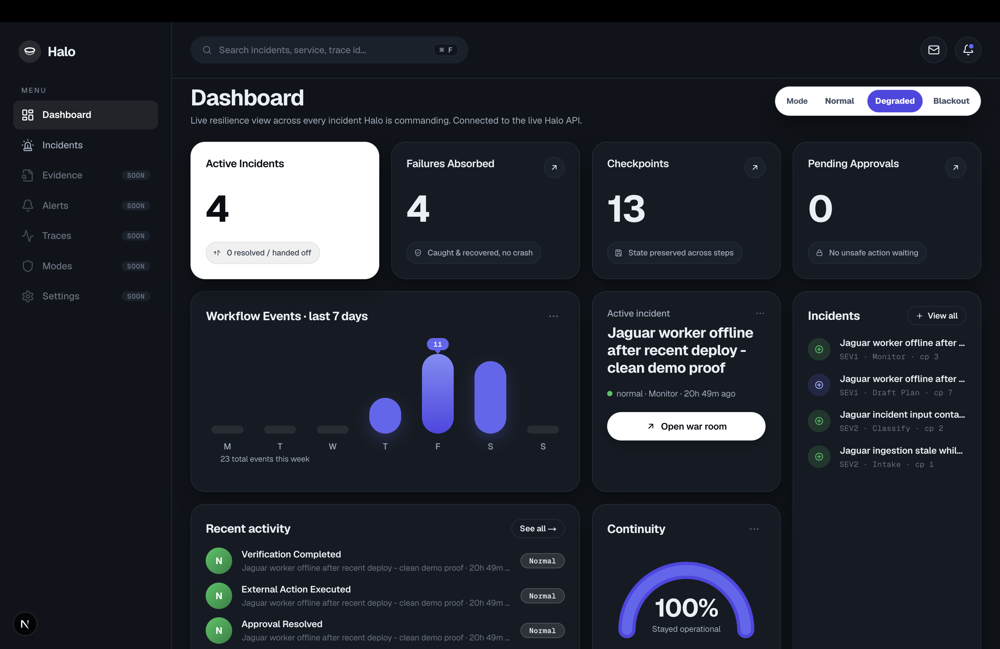

<div align="center">

# Halo

**A resilient incident commander agent — built to stay standing when its own infrastructure breaks.**

🌐 [**Live app**](https://haloagent.xyz) &nbsp;·&nbsp; ▶️ [**Live demo**](https://youtu.be/nW7aeeBrIZQ) &nbsp;·&nbsp; 📖 [**Docs**](https://haloagent.xyz/docs)

</div>

When a live product breaks, Halo investigates it, works out what's *actually* wrong, proposes a recovery action behind a human approval gate, executes it, and then checks whether it actually fixed the problem. The whole point is what happens when things go sideways: when models rate-limit, tools time out, or a provider falls over, Halo doesn't crash — it drops to a safer operating mode and keeps making progress.

It runs against a real live product (Jaguar), not a toy. Built for the TrueFoundry **Resilient Agents** hackathon on AWS Bedrock.

<div align="center">

[](https://youtu.be/nW7aeeBrIZQ)

▶️ **Watch the demo**

</div>

## Contents

- [What it actually does](#what-it-actually-does)
- [TrueFoundry: what we used and how](#truefoundry-what-we-used-and-how)
- [Get started](#get-started)
  - [Prerequisites](#prerequisites)
  - [1. Run the API](#1-run-the-api)
  - [2. Run the web app](#2-run-the-web-app)
  - [3. Connect TrueFoundry + Bedrock](#3-connect-truefoundry--bedrock)
- [How it works](#how-it-works)
- [Project structure](#project-structure)
- [API](#api)
- [Stack](#stack)

## What it actually does

Halo runs incidents through an explicit, checkpointed workflow with three operating modes:

- **Normal** — best model, full read + write (approval-gated) tools, multi-step investigation.
- **Degraded** — when the primary model or a tool keeps failing, Halo falls back to a faster/cheaper model and a read-only toolset, and keeps going.
- **Blackout** — when it's no longer safe to act, Halo stops writes, preserves state, and produces a clean handoff.

A real run looks like this: Halo pulls live evidence through MCP tools → diagnoses the incident → prepares a risky action (e.g. a worker restart) → waits for a human to approve → executes it through the live ops path → re-checks the product and reports whether the action actually worked. In our demo — a deterministic replay of a real run, captured in `infra/deploy/live-setup-status.md` — it correctly found that the restart was *necessary but insufficient*: the real root cause was an upstream credential failure, not the worker, so it didn't declare victory early.

Every step leaves a TrueFoundry trace, surfaced right in the UI: which model resolved, how many spans, which guardrails fired, and exactly which tools the agent called.

## TrueFoundry: what we used and how

TrueFoundry's AI Gateway is the control plane for everything Halo does — every model call, every tool call, every guardrail goes through it. This maps to the submission checklist:

- [x] **Model Gateway** — every LLM call routes through the gateway to AWS Bedrock. Nothing talks to a model directly.
- [x] **Virtual Models** — `halo-vm-normal` (primary Claude + fallback target) and `halo-vm-degraded` (Claude Haiku), priority-routed. This is what lets Halo *degrade instead of die*: on rate-limit / timeout / 5xx the gateway fails over to the next target, and our backend steps the agent down a mode — normal → degraded, then → blackout if failures keep coming.
- [x] **MCP Gateway — connect a custom MCP endpoint** — we connected our live product's MCP server (`jaguaralpha.xyz/api/mcp`) as a remote MCP, and used OpenAPI-to-MCP to turn our own incident/runbooks APIs into tools.
- [x] **MCP Gateway — Virtual MCP Servers** — `jaguar-observe` (read-only investigation) and `jaguar-act` (approval-gated writes). The agent's capability is decided by which virtual server it gets.
- [x] **MCP Gateway — toggle tools on/off in an MCP Server** — we curated the exact tool set per server: chaos/dangerous tools off, reads and writes split, and degraded/blackout modes only receive the observe server.
- [x] **Guardrails** — secrets/PII detection on model input and tool output. We have a real trace where the guardrail caught a planted secret and blocked the call.
- [x] **Other — Saved Agents + Agent Responses API** — three governed agents (`halo-normal`, `halo-degraded`, `halo-blackout`), each with its own virtual model, tool set, and iteration limit, invoked via `POST /api/llm/agent/{id}/responses`.
- [x] **Other — Request Logs / Tracing (Spans)** — every run is tagged with `X-TFY-METADATA` (incident, mode, scenario) and we pull spans back via the Query Spans API to render the "trace evidence" panel.

We deliberately **did not** use official remote MCP integrations (ours are custom), the rate-limit policy, or the budget-limit policy — Halo's resilience comes from virtual-model fallback plus mode downgrades rather than gateway quota policies. Agent system prompts live inside the saved agents rather than the standalone Prompts registry.

## Get started

### Prerequisites

- Python 3.12
- Node 18.18+ (or 20+)
- A TrueFoundry account with AI Gateway access and an AWS Bedrock connection (only needed for live model + tool calls; the UI and stored incidents run without it)

### 1. Run the API

```bash
cd apps/api
python3.12 -m venv .venv && source .venv/bin/activate
pip install -e ".[dev]"
uvicorn app.main:app --host 127.0.0.1 --port 8000
```

The API serves on `http://127.0.0.1:8000`. Check `GET /readiness` to see the active MCP servers and guardrail config.

### 2. Run the web app

```bash
cd apps/web
npm install
npm run dev -- --hostname 127.0.0.1 --port 3000
```

Open `http://127.0.0.1:3000`. The web app talks to the API at `http://127.0.0.1:8000` — override with `NEXT_PUBLIC_API_BASE_URL` if you moved it.

### 3. Connect TrueFoundry + Bedrock

Copy `infra/deploy/backend.env.example` to `apps/api/.env` and fill in your TrueFoundry gateway URL, virtual-account token, saved-agent IDs, and (if you're driving live actions) the ops bridge credentials. Restart the API and `GET /readiness` will show the gateway/guardrails as configured.

## How it works

```
Operator → War Room (Next.js) → Halo API (FastAPI)
                                     │
                                     ├── TrueFoundry AI Gateway → AWS Bedrock        (virtual models, fallback)
                                     ├── TrueFoundry MCP Gateway → jaguar-observe / jaguar-act
                                     ├── TrueFoundry Guardrails  (secrets / PII)
                                     └── TrueFoundry Spans API   (trace evidence)
```

The API owns an explicit incident state machine (`intake → classify → gather_evidence → draft_plan → execute_safe_actions → request_approval → monitor → handoff_or_close`). Mode logic and approvals live in our code; model routing, tool orchestration, guardrails, and tracing live in TrueFoundry. State is persisted and checkpointed after each stage, so a run resumes from its current stage instead of restarting at intake.

## Project structure

```
apps/web    Next.js dashboard + war room — incident view, trace evidence, approvals
apps/api    FastAPI workflow engine — state machine, mode logic, TrueFoundry + ops integration
infra       TrueFoundry config (agents, virtual MCP servers, guardrails), prompts, OpenAPI specs
```

## API

```
GET  /health                  liveness
GET  /readiness               config snapshot (active MCP servers, guardrails)
POST /incidents               create an incident
GET  /incidents               list incidents
GET  /incidents/{id}          incident detail (events, checkpoints, approvals, traces)
POST /incidents/{id}/run      advance one workflow stage (invokes the agent)
POST /incidents/{id}/approve  resolve an approval (forwards to the live ops path)
GET  /incidents/{id}/traces   TrueFoundry trace summary for the incident
```

## Stack

Next.js 15 · React 19 · Tailwind 4 · TypeScript · FastAPI · SQLModel · TrueFoundry AI + MCP Gateway · AWS Bedrock
